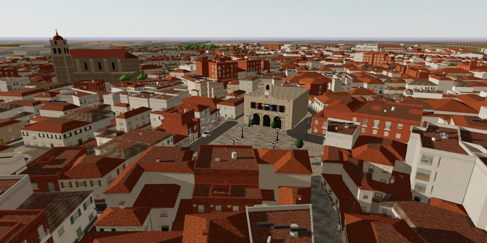

# Guareña · Vegas Altas

Juego de mundo abierto en el Guareña real (Badajoz, Extremadura), en el navegador: sus calles de
OpenStreetMap, los edificios del Catastro con su número de plantas, la Iglesia de Santa María, la Plaza de
España, el Pantano de San Roque… Misiones, coches, motos y bicis, tráfico, peatones, policía, bares, trabajos,
casas por dentro (sus ventanas dan a la calle de verdad), las tiendas del pueblo para entrar y comprar, un
inventario, tu casa para decorarla y con caja fuerte, la armería, la pesca en el pantano, radio, modos de terror
y de zombis, y multijugador con tus amigos.



## Jugar

- **En el navegador:** https://nestorguerra.github.io/guarena/
- **Multijugador en internet:** el servidor de la sala (ver [El servidor en internet](#el-servidor-en-internet-render)):
  ábrelo, entra en *Multijugador* y pásales el mismo enlace a tus amigos. Si nadie ha jugado en un rato, tarda
  cerca de un minuto en despertar.

Funciona en Chrome, Edge, Safari y Firefox con WebGL2, en ordenador y en móvil (con teclado y ratón, mando o
pantalla táctil). La primera vez necesita internet para descargar la librería 3D (three.js).

## Multijugador en tu ordenador

También puedes montar la sala en tu propio ordenador (hace falta Python 3):

```bash
python3 tools/build.py
python3 multijugador/servidor.py
```

Se abre el juego en el navegador; en *Multijugador* verás el enlace para tu amigo, en tu misma WiFi o por
internet (con un túnel gratuito, sin cuentas ni tocar el router). En la carpeta `multijugador/` hay accesos
directos de doble clic para macOS y Windows; más detalles en `multijugador/LEEME.txt`.

Las emisoras de radio reales de la zona suenan en directo en GitHub Pages, en el servidor y en tu ordenador; la
copia publicada en claude.ai no puede conectar con ellas y usa las tres emisoras del juego.

## El servidor en internet (Render)

`render.yaml` describe el servicio: empaqueta el juego (`python3 tools/build.py`) y arranca
`python3 multijugador/servidor.py --nube`, que sirve el juego y conecta a los jugadores (WebSocket, o sondeo HTTP
si algo corta los WebSocket). Solo usa la biblioteca estándar de Python; caben 8 jugadores por sala.

Para montarlo en tu cuenta: [Desplegar en Render](https://dashboard.render.com/blueprint/new?repo=https://github.com/nestorguerra/guarena)
(plan gratuito). Cada vez que se sube algo a `main` se vuelve a desplegar solo.

## Desarrollar

```bash
python3 tools/devserver.py 8918     # http://localhost:8918/index.html · el código fuente, sin empaquetar
python3 tools/build.py              # dist/guarena.html: el juego en un solo archivo
python3 tools/build_map.py          # regenera data/map.json desde OpenStreetMap y el Catastro
```

- `index.html` — pantallas, HUD y estilos · `src/` — el juego (módulos ES, three.js) · `assets/` — texturas y sonidos
- `data/map.json` — el pueblo ya procesado; `data/guarena.osm` el callejero de partida (los edificios del
  Catastro se descargan con `tools/fetch_catastro.py`)
- `tools/` — empaquetado, servidor local, mapa y pruebas automáticas: `audit.js` recorre todas las calles a pie
  y en coche, `missionbot.js` juega las misiones, `playtest.js` conduce, pelea, hace de taxista…
- `multijugador/` — el servidor de la sala · `.github/workflows/pages.yml` — publica el juego en GitHub Pages

Si defines la variable de repositorio `GUARENA_MP_URL` con la dirección del servidor, la copia de GitHub Pages
enlaza con él desde la pantalla *Multijugador*.

## Datos y créditos

- Callejero © colaboradores de [OpenStreetMap](https://www.openstreetmap.org/copyright), bajo la licencia
  ODbL: `data/map.json` y `data/guarena.osm` contienen esos datos y se comparten con la misma licencia.
- Edificios: Dirección General del Catastro (servicio INSPIRE), reutilizables citando la fuente.
- Texturas fotográficas: [Poly Haven](https://polyhaven.com) (CC0). Sonidos de terror y zombis:
  [OpenGameArt](https://opengameart.org) (CC0).
- Personajes, vehículos, historias y misiones son ficticios. Los bares y comercios llevan nombres inventados:
  ningún negocio real aparece por su nombre.
